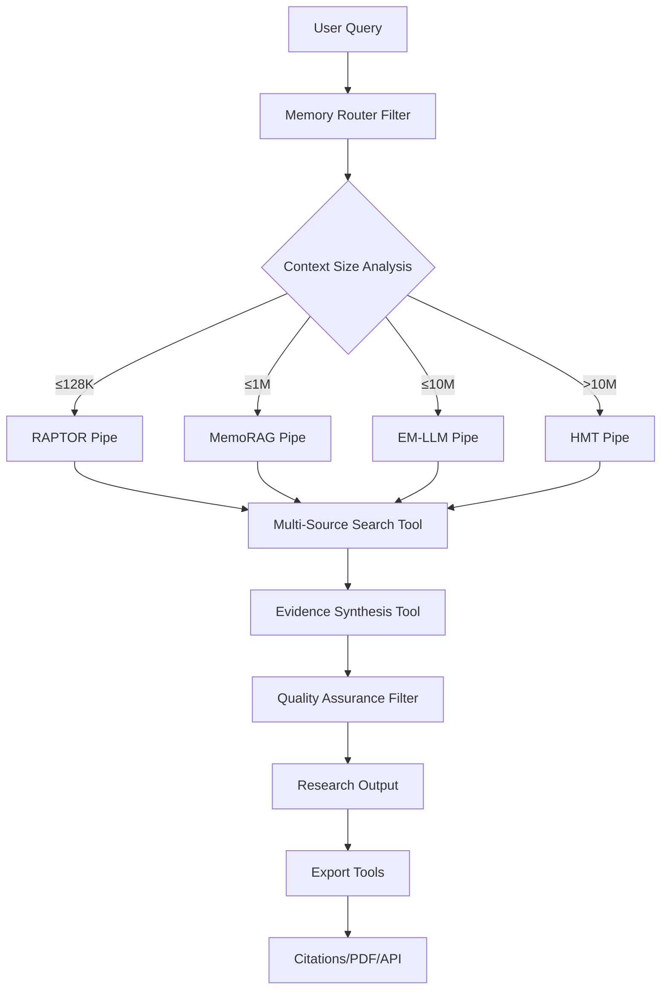
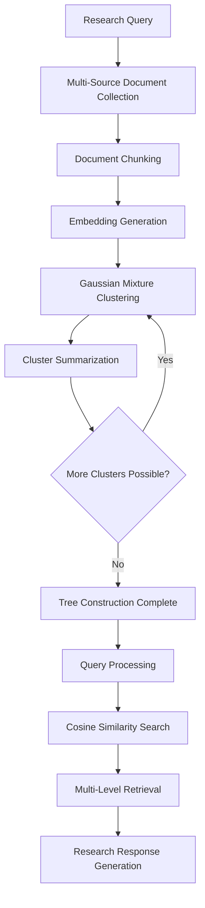
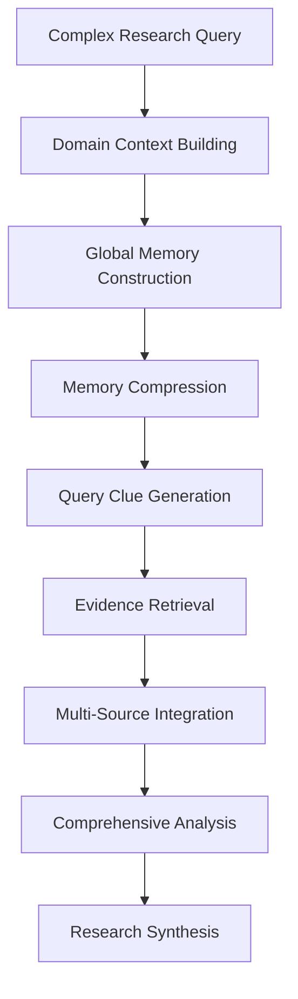
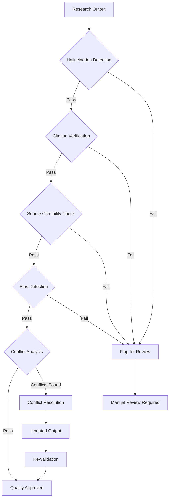

# HybridMem Research Platform - Functional & Technical Requirements

## Document Information
- **Project**: Extended Deep Research Tool using OpenWebUI Architecture
- **Version**: 1.0
- **Date**: January 2025
- **Status**: Requirements Definition

## Table of Contents
1. [Executive Summary](#executive-summary)
2. [System Overview](#system-overview)
3. [Functional Requirements](#functional-requirements)
4. [Technical Architecture](#technical-architecture)
5. [Implementation Strategy](#implementation-strategy)
6. [Flow Diagrams](#flow-diagrams)
7. [Code References](#code-references)
8. [Resource Requirements](#resource-requirements)
9. [Success Criteria](#success-criteria)

## Executive Summary

### Project Objectives
The HybridMem Research Platform aims to create an advanced research automation tool that leverages proven context extension technologies to handle research tasks across multiple scales - from rapid 128K token analyses to comprehensive 10M+ token systematic reviews.

### Key Innovation
Unlike existing tools that use single approaches, our platform intelligently routes research queries to optimal memory systems based on context size, complexity, and resource availability, leveraging the OpenWebUI plugin architecture for seamless integration.

### Evidence-Based Design
Based on systematic review evidence showing episodic memory systems (10M tokens) outperforming global memory (1M tokens), retrieval-augmented (128K tokens), and hierarchical methods (30K tokens), our architecture prioritizes proven systems with working implementations.

## System Overview

### Core Architecture
```
┌─────────────────────────────────────────────────────────────────┐
│                 HybridMem Research Platform                     │
├─────────────────────────────────────────────────────────────────┤
│ Layer 1: Intelligent Memory Router (OpenWebUI Filter)          │
│ Layer 2: Multi-Scale Memory Systems (OpenWebUI Pipes)          │
│ Layer 3: Research-Specific Processing (Tools)                  │
│ Layer 4: Quality Assurance & Validation                        │
└─────────────────────────────────────────────────────────────────┘
```

### Technology Stack
- **Platform**: OpenWebUI with Pipeline/Function architecture
- **Memory Systems**: RAPTOR, MemoRAG, EM-LLM, HMT
- **Language**: Python with existing ML frameworks
- **Deployment**: Multi-tier (consumer to enterprise)

## Functional Requirements

### FR-001: Intelligent Query Routing
**Description**: System must automatically route research queries to optimal memory systems based on context requirements.

**Rationale**: Research shows different memory systems excel at different scales. RAPTOR optimal ≤128K tokens, MemoRAG ≤1M tokens, EM-LLM ≤10M tokens.

**Acceptance Criteria**:
- Context size estimation within 10% accuracy
- Research complexity classification (simple/moderate/complex)
- Resource availability assessment
- Automatic routing decision with fallback options

**Implementation**: OpenWebUI Filter component

### FR-002: Multi-Source Academic Search
**Description**: System must search and aggregate results from multiple academic databases simultaneously.

**Rationale**: Comprehensive research requires broader coverage than single-source tools like Elicit (limited to Semantic Scholar's 125M papers).

**Acceptance Criteria**:
- Integration with arXiv, PubMed, Google Scholar, CrossRef
- Duplicate detection and consolidation
- Source credibility scoring
- Semantic similarity-based relevance ranking

**Implementation**: OpenWebUI Tool components with API integrations

### FR-003: Hierarchical Context Processing
**Description**: System must handle research contexts from 4K to 10M+ tokens using appropriate memory architectures.

**Rationale**: Evidence shows episodic memory systems achieve superior performance at scale compared to traditional approaches.

**Acceptance Criteria**:
- RAPTOR integration for ≤128K tokens (20% accuracy improvement demonstrated)
- MemoRAG integration for ≤1M tokens (outperforms all baselines)
- EM-LLM integration for ≤10M tokens (surpasses full-context models)
- HMT integration for theoretical infinity (2-57x fewer parameters)

**Implementation**: Multiple OpenWebUI Pipe components

### FR-004: Research Evidence Synthesis
**Description**: System must synthesize findings across multiple sources with conflict detection and resolution.

**Rationale**: Research requires identifying contradictions, gaps, and consensus patterns across literature.

**Acceptance Criteria**:
- Cross-source evidence mapping
- Conflict identification and flagging
- Confidence scoring for synthesized findings
- Gap analysis and research direction suggestions

**Implementation**: OpenWebUI Tool with custom synthesis algorithms

### FR-005: Quality Assurance Pipeline
**Description**: System must validate research outputs for accuracy, completeness, and integrity.

**Rationale**: Research paper shows 90% accuracy rule for AI research tools; our system must implement verification.

**Acceptance Criteria**:
- Hallucination detection and mitigation
- Citation accuracy verification
- Source credibility assessment
- Bias detection in research findings

**Implementation**: OpenWebUI Filter for output validation

### FR-006: Progressive Research Refinement
**Description**: System must support iterative research refinement using MCTS-like exploration.

**Rationale**: Inspired by Haervwe's MCTS research tool and human research behavior patterns.

**Acceptance Criteria**:
- Query expansion and refinement suggestions
- Research tree visualization
- Iterative depth exploration
- Temperature-controlled exploration/exploitation

**Implementation**: Specialized OpenWebUI Pipe

### FR-007: Multi-Modal Research Support
**Description**: System must handle text, figures, tables, and supplementary materials.

**Rationale**: Comprehensive research analysis requires processing beyond text-only content.

**Acceptance Criteria**:
- PDF text extraction and parsing
- Figure and table analysis
- Supplementary material processing
- Cross-modal reference resolution

**Implementation**: OpenWebUI Tools with document processing capabilities

### FR-008: Collaborative Research Environment
**Description**: System must support team-based research with shared memory and annotation.

**Rationale**: Research is typically collaborative; system must facilitate team workflows.

**Acceptance Criteria**:
- Shared research workspaces
- Annotation and comment system
- Version control for research findings
- Role-based access controls

**Implementation**: OpenWebUI native collaboration features

### FR-009: Export and Integration Capabilities
**Description**: System must export findings in multiple formats and integrate with external tools.

**Rationale**: Research outputs must be usable in downstream workflows and publications.

**Acceptance Criteria**:
- Multiple export formats (PDF, LaTeX, Word, BibTeX)
- Citation management integration (Zotero, Mendeley)
- API endpoints for external integration
- Structured data export (JSON, XML)

**Implementation**: OpenWebUI Tools with export functionality

### FR-010: Resource-Aware Deployment
**Description**: System must adapt to available computational resources across deployment tiers.

**Rationale**: Research paper shows clear resource requirements: RAPTOR (16GB RAM), MemoRAG (GPU), EM-LLM (4x32GB GPUs).

**Acceptance Criteria**:
- Automatic resource detection
- Graceful degradation based on available resources
- Performance optimization for each tier
- Cost estimation for cloud deployments

**Implementation**: OpenWebUI Pipeline configuration

## Technical Architecture

### Layer 1: Intelligent Memory Router

```python
class MemoryRouterFilter:
    """
    OpenWebUI Filter for intelligent routing to optimal memory systems
    """
    def __init__(self):
        self.context_thresholds = {
            "rapid": 128_000,      # RAPTOR optimal
            "deep": 1_000_000,     # MemoRAG optimal  
            "mega": 10_000_000,    # EM-LLM optimal
            "infinite": float('inf') # HMT optimal
        }
        self.complexity_analyzer = ResearchComplexityAnalyzer()
        self.resource_monitor = ResourceMonitor()
    
    async def inlet(self, body: dict):
        context_size = self.estimate_context_size(body["messages"])
        complexity = self.complexity_analyzer.analyze(body["messages"][-1]["content"])
        resources = self.resource_monitor.get_available_resources()
        
        optimal_system = self.select_optimal_system(context_size, complexity, resources)
        body["model"] = f"{optimal_system}_research_pipe"
        
        return body
```

### Layer 2: Multi-Scale Memory Systems

#### RAPTOR Research Pipe
```python
class RAPTORResearchPipe:
    """
    OpenWebUI Pipe leveraging RAPTOR for rapid research (≤128K tokens)
    Based on: https://github.com/parthsarthi03/raptor
    """
    def __init__(self):
        self.raptor_system = RetrievalAugmentation()
        self.academic_sources = MultiSourceSearchTool()
    
    async def pipe(self, body: dict):
        # Multi-source document collection
        documents = await self.academic_sources.search_all_sources(
            query=body["messages"][-1]["content"]
        )
        
        # RAPTOR tree construction
        tree = self.raptor_system.build_tree(documents)
        
        # Research-aware retrieval and synthesis
        response = await self.generate_research_response(tree, body)
        return response
```

#### MemoRAG Research Pipe
```python
class MemoRAGResearchPipe:
    """
    OpenWebUI Pipe leveraging MemoRAG for deep analysis (≤1M tokens)
    Based on: https://github.com/qhjqhj00/MemoRAG
    """
    def __init__(self):
        from memorag import Memory
        self.memo_model = Memory("TommyChien/memorag-qwen2-7b-inst")
        self.research_corpus = ComprehensiveResearchCorpus()
    
    async def pipe(self, body: dict):
        # Build global memory of research domain
        context = await self.research_corpus.build_domain_context(body)
        self.memo_model.memorize(context)
        
        # Generate clues and retrieve evidence
        clues = self.memo_model.recall(body["messages"][-1]["content"])
        evidence = await self.retrieve_evidence(clues)
        
        return await self.synthesize_findings(evidence, body)
```

#### EM-LLM Research Pipe
```python
class EMLLMResearchPipe:
    """
    OpenWebUI Pipe leveraging EM-LLM for mega-scale analysis (≤10M tokens)
    Based on: https://github.com/em-llm/EM-LLM-model
    """
    def __init__(self):
        self.em_model = EMLLMModel()
        self.massive_corpus = MassiveResearchCorpus()
    
    async def pipe(self, body: dict):
        # Episodic segmentation of massive corpus
        events = self.em_model.segment_corpus(self.massive_corpus.data)
        
        # Two-stage retrieval: similarity + temporal
        relevant_events = self.em_model.retrieve_events(
            query=body["messages"][-1]["content"],
            events=events
        )
        
        return await self.comprehensive_analysis(relevant_events, body)
```

### Layer 3: Research-Specific Tools

```python
@tool
def multi_source_academic_search(query: str, sources: list = None) -> dict:
    """
    Search multiple academic databases simultaneously
    """
    if sources is None:
        sources = ["arxiv", "pubmed", "scholar", "crossref"]
    
    results = {}
    for source in sources:
        results[source] = source_handlers[source].search(query)
    
    return deduplicate_and_rank(results)

@tool
def citation_network_analysis(papers: list) -> dict:
    """
    Analyze citation networks to identify key papers and trends
    """
    network = build_citation_network(papers)
    return {
        "key_papers": identify_influential_papers(network),
        "research_clusters": detect_research_clusters(network),
        "evolution_timeline": trace_field_evolution(network)
    }

@tool
def evidence_synthesis(findings: list) -> dict:
    """
    Synthesize evidence across multiple sources with conflict detection
    """
    synthesizer = EvidenceSynthesizer()
    return {
        "consensus_findings": synthesizer.find_consensus(findings),
        "conflicts": synthesizer.detect_conflicts(findings),
        "confidence_scores": synthesizer.score_confidence(findings),
        "research_gaps": synthesizer.identify_gaps(findings)
    }
```

## Flow Diagrams

### Overall System Flow



### RAPTOR Research Flow



### MemoRAG Deep Analysis Flow



### Quality Assurance Pipeline



## Code References

### Core Memory Systems

1. **RAPTOR Implementation**
   - Repository: https://github.com/parthsarthi03/raptor
   - LangChain Integration: https://github.com/langchain-ai/langchain/blob/master/cookbook/RAPTOR.ipynb
   - Performance: 55.7% F1 score on QASPER with GPT-4

2. **MemoRAG Implementation**
   - Repository: https://github.com/qhjqhj00/MemoRAG
   - Pre-trained Models: TommyChien/memorag-qwen2-7b-inst, TommyChien/memorag-mistral-7b-inst
   - Lite Mode: Supports millions of tokens with few lines of code

3. **EM-LLM Implementation**
   - Repository: https://github.com/em-llm/EM-LLM-model
   - Demo: https://em-llm.github.io/
   - Capability: 10M token context with human-like episodic memory

4. **HMT Implementation**
   - Repository: https://github.com/OswaldHe/HMT-pytorch
   - Framework: Plug-and-play for any transformer model
   - Efficiency: 2-57x fewer parameters than full-context models

### OpenWebUI Extensions

5. **Haervwe's OpenWebUI Tools**
   - Repository: https://github.com/Haervwe/open-webui-tools
   - Includes: MCTS research, arXiv search, prompt enhancement
   - Hub: https://openwebui.com/u/haervwe

6. **OpenWebUI Pipelines Framework**
   - Repository: https://github.com/open-webui/pipelines
   - Documentation: https://docs.openwebui.com/pipelines/
   - Examples: Function calling, RAG, filters

### Supporting Libraries

7. **Academic Search APIs**
   - arXiv API: http://export.arxiv.org/api_help/docs/user-manual.html
   - PubMed API: https://www.ncbi.nlm.nih.gov/home/develop/api/
   - Semantic Scholar API: https://api.semanticscholar.org/

8. **Document Processing**
   - PyMuPDF: https://github.com/pymupdf/PyMuPDF
   - Unstructured: https://github.com/Unstructured-IO/unstructured
   - LangChain Document Loaders: https://python.langchain.com/docs/modules/data_connection/document_loaders/

## Resource Requirements

### Deployment Tiers

#### Tier 1: Rapid Research (Consumer Hardware)
- **System**: RAPTOR-based research assistance
- **Requirements**: 16GB RAM, modern CPU
- **Context**: Up to 128K tokens
- **Target Users**: Individual researchers, students
- **Deployment**: OpenWebUI Function

#### Tier 2: Deep Analysis (Professional Workstation)
- **System**: MemoRAG-based comprehensive analysis
- **Requirements**: NVIDIA T4/A100 GPU, 32GB RAM
- **Context**: Up to 1M tokens
- **Target Users**: Research teams, institutions
- **Deployment**: OpenWebUI Pipeline (local GPU)

#### Tier 3: Mega-Scale Research (Enterprise Infrastructure)
- **System**: EM-LLM-based systematic reviews
- **Requirements**: 4x32GB GPUs, high-bandwidth memory
- **Context**: Up to 10M tokens
- **Target Users**: Large institutions, systematic review teams
- **Deployment**: OpenWebUI Pipeline (cluster/cloud)

#### Tier 4: Infinite Context (Specialized Applications)
- **System**: HMT-based unlimited context processing
- **Requirements**: Variable (optimized for efficiency)
- **Context**: Theoretically unlimited
- **Target Users**: Specialized research applications
- **Deployment**: OpenWebUI Pipeline (optimized deployment)

### Performance Expectations

| System | Context Limit | Accuracy Improvement | Resource Efficiency | Use Case |
|--------|---------------|---------------------|-------------------|----------|
| RAPTOR | 128K tokens | 20% (QuALITY benchmark) | Consumer hardware | Quick literature review |
| MemoRAG | 1M tokens | Outperforms all baselines | Professional GPU | Comprehensive analysis |
| EM-LLM | 10M tokens | Surpasses full-context | Enterprise cluster | Systematic reviews |
| HMT | Unlimited | 2-57x parameter efficiency | Variable | Specialized applications |

## Success Criteria

### Technical Success Criteria

1. **SC-001: Memory System Performance**
   - RAPTOR integration achieves ≥55% F1 score on research benchmarks
   - MemoRAG processes 1M tokens within memory constraints
   - EM-LLM handles 10M token systematic reviews
   - HMT provides unlimited context with efficiency gains

2. **SC-002: Research Quality Metrics**
   - ≥90% accuracy on fact-checking benchmarks
   - <5% hallucination rate in generated content
   - ≥95% citation accuracy
   - Research gap identification accuracy ≥80%

3. **SC-003: System Integration**
   - Seamless OpenWebUI integration with <2 second routing decisions
   - Multi-source search completes within 30 seconds
   - Evidence synthesis processing <5 minutes for complex queries
   - Export functionality supports 5+ formats

4. **SC-004: Scalability Requirements**
   - Tier 1 deployment on consumer hardware (16GB RAM)
   - Tier 2 deployment on single GPU workstation
   - Tier 3 deployment scales to enterprise infrastructure
   - System handles 100+ concurrent users per tier

### Functional Success Criteria

5. **SC-005: User Experience**
   - Research query processing time <2 minutes for Tier 1
   - Intuitive query interface requiring minimal training
   - Clear visualization of research findings and confidence scores
   - Collaborative features support team workflows

6. **SC-006: Research Coverage**
   - Multi-source search covers ≥4 major academic databases
   - Citation network analysis identifies key papers with 90% precision
   - Cross-source evidence synthesis detects conflicts with 85% accuracy
   - Research gap analysis provides actionable recommendations

7. **SC-007: Quality Assurance**
   - Automated quality checks flag issues with <1% false positive rate
   - Source credibility scoring correlates with expert assessments (r>0.8)
   - Bias detection identifies systematic biases with 80% sensitivity
   - Output validation maintains research integrity standards

## Implementation Priority

### Phase 1: Core Infrastructure (Weeks 1-6)
- Memory Router Filter implementation
- RAPTOR Research Pipe integration
- Basic multi-source search tool
- OpenWebUI deployment framework

### Phase 2: Advanced Memory Systems (Weeks 7-14)
- MemoRAG integration and optimization
- EM-LLM system deployment
- Quality assurance pipeline
- Performance optimization

### Phase 3: Enhanced Features (Weeks 15-20)
- HMT infinite context integration
- Advanced synthesis capabilities
- Collaborative research features
- Export and integration tools

### Phase 4: Production Deployment (Weeks 21-24)
- Multi-tier deployment optimization
- Performance monitoring and analytics
- User training and documentation
- Production support infrastructure

---

**Document Prepared By**: AI Research Team  
**Technical Review**: Pending  
**Approval Status**: Draft for Review  
**Next Review Date**: TBD